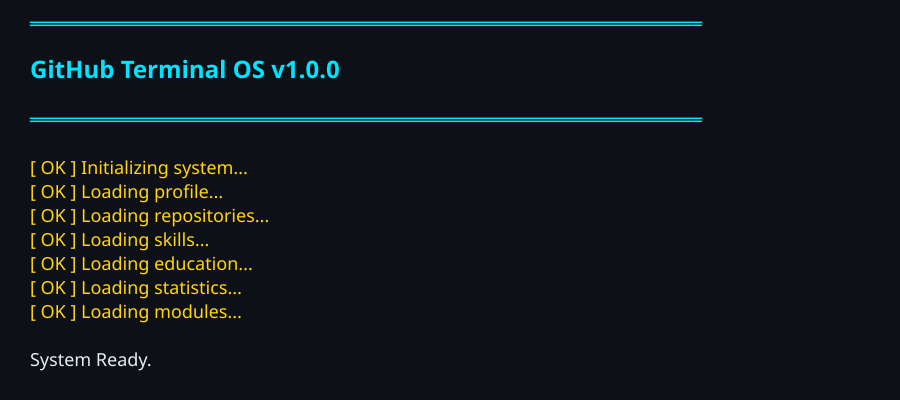
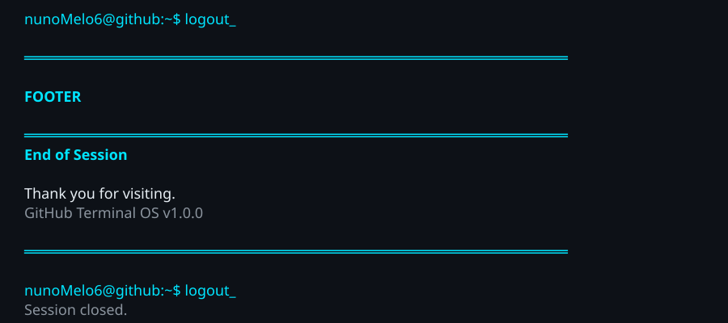

# Main Menu

> Select a module

- [Header](#header)
- [About](#about)
- [Projects](#projects)
- [Skills](#skills)
- [Education](#education)
- [Statistics](#statistics)
- [Quests](#quests)
- [Timeline](#timeline)
- [Contact](#contact)

## Header

## About

## Projects

## Skills

## Education

## Statistics

## Quests

## Timeline

## Contact

## Footer

